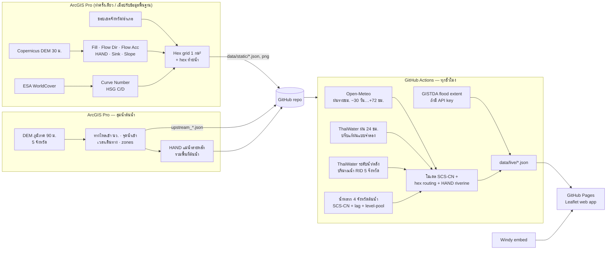

# Nakhon Sawan Flood Watch 🌧️🗺️

Web app ติดตาม **พื้นที่น้ำท่วมขัง ความลึก และระยะเวลาท่วม** ของจังหวัดนครสวรรค์ แบบ near-realtime (อัปเดตทุก 1 ชั่วโมง)
ชั้นข้อมูลภูมิประเทศวิเคราะห์ด้วย **ArcGIS Pro** ส่วนข้อมูลฝน/ระดับน้ำดึงอัตโนมัติจาก **Open-Meteo, ThaiWater (สสน.), GISTDA** และแสดง **Windy** ประกอบ
โฮสต์ฟรีบน **GitHub Pages** + **GitHub Actions**

## สถาปัตยกรรม



| ชั้น | เทคโนโลยี | ไฟล์ |
|---|---|---|
| วิเคราะห์ภูมิประเทศ | ArcGIS Pro 3.x + Spatial Analyst | `arcgis/build_static.py`, `arcgis/NakhonSawanFlood.pyt` |
| ดึงข้อมูล + โมเดล | Python 3 (stdlib + numpy) | `pipeline/run_update.py`, `pipeline/model.py` |
| ตั้งเวลา + deploy | GitHub Actions + Pages | `.github/workflows/update.yml` |
| หน้าเว็บ | Leaflet 1.9 (ไม่มี build step) | `index.html`, `assets/` |

รายละเอียดสมการและเหตุผลการออกแบบ: [`docs/ARCHITECTURE.md`](docs/ARCHITECTURE.md)

## ฟีเจอร์บนเว็บ

- แผนที่ hex 1 กม² แสดงระดับน้ำท่วมขัง 5 ชั้น พร้อม **แถบเวลา −7 วัน ถึง +72 ชม.** (กดเล่นเป็นแอนิเมชันได้)
- โหมดแผนที่: ท่วมขังตอนนี้ · สูงสุดใน 72 ชม. · ระยะเวลาท่วม · ฝน 24 ชม./7 วัน · ฝนพยากรณ์ 72 ชม.
- แท็บอำเภอ: พื้นที่ท่วม + **ระยะเวลาท่วม** (ท่วมมาแล้ว → คาดลดใน, แถบสีแยก < 1 วัน / 1–3 / 3–7 / 7–14 / > 14 วัน) และสรุปทั้งจังหวัด
- แท็บต้นน้ำ: hydrograph ค่าตรวจวัด 7 วัน + พยากรณ์ที่ลดตามอัตราน้ำลดจริงของสถานี, ล้นตลิ่งมาแล้วกี่ชั่วโมง, คาดต่ำกว่าความจุเมื่อไร
- คลิก hex: ความลึก, สาเหตุ (ฝน/ล้นตลิ่ง), **ท่วมมาแล้วกี่ชั่วโมง, คาดว่าจะลดลงเมื่อไร**, ฝนสะสม, ค่า HAND/CN จาก ArcGIS Pro
- **แท็บต้นน้ำ**: น้ำจากกำแพงเพชร พิจิตร พิษณุโลก เพชรบูรณ์ — ปริมาตรที่จะไหลเข้า นว. ใน 72 ชม. รายจังหวัด, hydrograph + พยากรณ์ของปิง/น่าน-ยม/แม่วงก์/เจ้าพระยา เทียบความจุลำน้ำ, พื้นที่ที่ราบลุ่มน้ำล้นตลิ่ง, แผนที่ลุ่มน้ำและจุดน้ำเข้า
- **แท็บ 2D จุดวิกฤต**: แผนที่ความลึกความละเอียด 120 ม. (ลาดยาว, เมืองนครสวรรค์, ชุมแสง) ตอนนี้/+24/+48/+72 ชม./สูงสุด, ชั้นคลอง คันกั้นน้ำ สถานีสูบ ประตูระบายน้ำ และผลการสอบเทียบ
- สรุปรายอำเภอ, สถานีระดับน้ำ (สถานการณ์ตามตลิ่ง), สถานีวัดฝน, กราฟฝนรายชั่วโมง, แท็บ Windy (ฝน/ฝนสะสม/เรดาร์/เมฆ)
- ชั้นพื้นที่ลุ่มต่ำ (HAND) จาก ArcGIS Pro, ชั้นน้ำท่วมจากดาวเทียม GISTDA (ถ้าเปิดใช้)
- รีเฟรชข้อมูลเองทุก 5 นาที · ใช้บนมือถือได้

## วิธี deploy ขึ้น GitHub (ครั้งแรก ~10 นาที)

1. สร้าง repo ใหม่บน GitHub แบบ **Public** (เช่น `nakhonsawan-flood`) — ไม่ต้องติ๊ก add README
2. ในโฟลเดอร์นี้ (มี `git init` และ commit แรกไว้แล้ว):
   ```bash
   git remote add origin https://github.com/<user>/nakhonsawan-flood.git
   git push -u origin main
   ```
3. GitHub → **Settings → Pages → Build and deployment → Source: GitHub Actions**
4. **Actions** → เลือก `update-flood-data` → **Run workflow** (ครั้งแรก) — จากนั้นจะรันเองทุกชั่วโมง
5. เปิด `https://<user>.github.io/nakhonsawan-flood/`

(ตัวเลือก) เปิดชั้นน้ำท่วมจากดาวเทียม GISTDA: สมัคร API key ที่ [GISTDA Sphere / Disaster API](https://sphere.gistda.or.th/docs/web-service/disaster-information) แล้วใส่ใน **Settings → Secrets and variables → Actions → New secret** ชื่อ `GISTDA_API_KEY`

> ⚠️ GitHub ปิด scheduled workflow อัตโนมัติถ้า repo ไม่มี commit 60 วัน — workflow นี้มีขั้นตอน keepalive ให้แล้ว
> ⚠️ ถ้า runner ของ GitHub (อยู่ต่างประเทศ) ดึง ThaiWater ไม่ได้ ระบบจะยังทำงานด้วย Open-Meteo อย่างเดียว (ดูสถานะในแท็บ "วิธีการ") หรือใช้ self-hosted runner / รัน tool ที่ 2 ใน ArcGIS Pro แทน

## การใช้งานใน ArcGIS Pro

Catalog → Toolboxes → Add Toolbox → `arcgis/NakhonSawanFlood.pyt`

| Tool | ทำอะไร |
|---|---|
| **0) Build All** | FABDEM + burn ลำน้ำ/คันกั้นน้ำ OSM → 1 → 1b → 1c → 1d (ชั้นข้อมูลคงที่ใหม่ทั้งหมด, 30–60 นาที) |
| 1) Build Static Layers | Fill/FlowDir/FlowAcc/HAND/แอ่ง/CN → hex 1 กม² |
| 1b) Build Upstream Basins | ลุ่มน้ำกำแพงเพชร พิจิตร พิษณุโลก เพชรบูรณ์ ที่ไหลเข้า นว., จุดน้ำเข้า, เวลาเดินทาง, HAND แม่น้ำสายหลัก |
| 1c) Build Network & Drainage | การไหลหลายทิศ, จุดล้นระหว่าง hex, hypsometry, คลอง/สถานีสูบ/ประตูน้ำ (รันใหม่หลังแก้ `drainage_assets_user.csv`) |
| 1d) Build 2D Hotspots | โดเมนแบบจำลอง 2D + ชุดข้อมูล HEC-RAS (`hecras/`) |
| 2) Run Update (local) | รันโมเดลบนเครื่อง → feature class `hex_status` |
| 2b) Run 2D Hotspots | แบบจำลอง 2D + rain.csv / stage_*.csv สำหรับ HEC-RAS |
| 2c) Calibrate | สอบเทียบโมเดล hex กับผล 2D → `calibration.json` |
| 3) Publish to GitHub | commit + push |

Command line: `python pipeline/run_update.py --site .` → `python pipeline/run_hotspots.py --site .` → `python pipeline/calibrate.py --site .`
ทดสอบเว็บ: `python -m http.server 8000`

**เพิ่มข้อมูลโครงสร้างระบายน้ำจริง** (ความจุสถานีสูบ, ประตูระบายน้ำที่ OSM ไม่มี): แก้ `data/static/drainage_assets_user.csv`
(`type,name,lon,lat,capacity_m3s,note` — type = pump หรือ gate) แล้วรัน tool 1c

## โครงสร้างโฟลเดอร์

```
index.html, assets/app.js, assets/app.css   หน้าเว็บ
data/static/   hex.geojson, params.json, districts.geojson, province.geojson,
               susceptibility.png/.json, stations_ref.json,
               upstream_zones.json, upstream_entries.json, upstream_basins.geojson   ← จาก ArcGIS Pro
data/live/     meta, status, frames, stations, districts, series, upstream,
               gauges_hist, rain_cache (.json)                             ← จาก pipeline ทุกชั่วโมง
pipeline/      run_update.py (ดึงข้อมูล + เขียนผล), model.py (โมเดล hex v3), upstream.py (น้ำหลากจากต้นน้ำ), gauges.py (ประวัติสถานี/rating/recession),
               model2d.py + run_hotspots.py (แบบจำลอง 2D), calibrate.py (สอบเทียบ)
arcgis/        build_static.py, build_upstream.py, build_network.py, build_hotspots.py, NakhonSawanFlood.pyt
hecras/        ชุดข้อมูลสำหรับ HEC-RAS 2D ของแต่ละจุดวิกฤต
docs/          ARCHITECTURE.md
```

## ข้อจำกัด

โมเดล hex เป็น **screening model** ความละเอียด 1 กม² (มีแบบจำลอง 2D 120 ม. เฉพาะจุดวิกฤต) สำหรับเตือนภัยล่วงหน้าและจัดลำดับพื้นที่เฝ้าระวัง ไม่ใช่แบบจำลองชลศาสตร์ 2 มิติ
ความลึกเป็นค่าประมาณ ควรสอบเทียบกับพื้นที่น้ำท่วมจริงจาก GISTDA/รายงานภาคสนามก่อนใช้ประกอบการตัดสินใจ

## แหล่งข้อมูลและสัญญาอนุญาต

Open-Meteo (CC BY 4.0, non-commercial ฟรี) · ThaiWater / สถาบันสารสนเทศทรัพยากรน้ำ (สสน.) · GISTDA · Windy.com (embed) ·
FABDEM V1-2 (Hawker et al. 2022, **CC BY-NC-SA 4.0 — ใช้เชิงพาณิชย์ไม่ได้**; ถ้าจะใช้เชิงพาณิชย์ให้กลับไปใช้ Copernicus DEM) · OpenStreetMap (ODbL) ·
Copernicus DEM GLO-30 © DLR e.V. 2010–2014 and © Airbus Defence and Space GmbH 2014–2018, provided under COPERNICUS by the European Union and ESA ·
ESA WorldCover 2021 (CC BY 4.0) · geoBoundaries (CC BY 4.0) · แผนที่ฐาน © OpenStreetMap, CARTO, Esri
