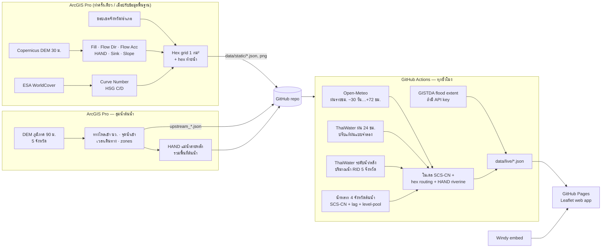

# Nakhon Sawan Flood Watch 🌧️🗺️

Web app ติดตาม **พื้นที่น้ำท่วมขัง ความลึก และระยะเวลาท่วม** ของจังหวัดนครสวรรค์ แบบ near-realtime (อัปเดตทุก 1 ชั่วโมง)
ชั้นข้อมูลภูมิประเทศวิเคราะห์ด้วย **ArcGIS Pro** ส่วนข้อมูลฝน/ระดับน้ำดึงอัตโนมัติจาก **Open-Meteo, ThaiWater (สสน.), GISTDA** และแสดง **Windy** ประกอบ
โฮสต์ฟรีบน **GitHub Pages** + **GitHub Actions**

## สถาปัตยกรรม



| ชั้น | เทคโนโลยี | ไฟล์ |
|---|---|---|
| วิเคราะห์ภูมิประเทศ | ArcGIS Pro 3.x + Spatial Analyst | `arcgis/build_static.py`, `arcgis/NakhonSawanFlood.pyt` |
| ดึงข้อมูล + โมเดล | Python 3 (stdlib + numpy) | `pipeline/run_update.py`, `pipeline/model.py` |
| ตั้งเวลา + deploy | GitHub Actions + Pages | `.github/workflows/update.yml` |
| หน้าเว็บ | Leaflet 1.9 (ไม่มี build step) | `index.html`, `assets/` |

รายละเอียดสมการและเหตุผลการออกแบบ: [`docs/ARCHITECTURE.md`](docs/ARCHITECTURE.md)

## ฟีเจอร์บนเว็บ

- แผนที่ hex 1 กม² แสดงระดับน้ำท่วมขัง 5 ชั้น พร้อม **แถบเวลา −7 วัน ถึง +72 ชม.** (กดเล่นเป็นแอนิเมชันได้)
- โหมดแผนที่: ท่วมขังตอนนี้ · สูงสุดใน 72 ชม. · ระยะเวลาท่วม · ฝน 24 ชม./7 วัน · ฝนพยากรณ์ 72 ชม.
- คลิก hex: ความลึก, สาเหตุ (ฝน/ล้นตลิ่ง), **ท่วมมาแล้วกี่ชั่วโมง, คาดว่าจะลดลงเมื่อไร**, ฝนสะสม, ค่า HAND/CN จาก ArcGIS Pro
- **แท็บต้นน้ำ**: น้ำจากกำแพงเพชร พิจิตร พิษณุโลก เพชรบูรณ์ — ปริมาตรที่จะไหลเข้า นว. ใน 72 ชม. รายจังหวัด, hydrograph + พยากรณ์ของปิง/น่าน-ยม/แม่วงก์/เจ้าพระยา เทียบความจุลำน้ำ, พื้นที่ที่ราบลุ่มน้ำล้นตลิ่ง, แผนที่ลุ่มน้ำและจุดน้ำเข้า
- สรุปรายอำเภอ, สถานีระดับน้ำ (สถานการณ์ตามตลิ่ง), สถานีวัดฝน, กราฟฝนรายชั่วโมง, แท็บ Windy (ฝน/ฝนสะสม/เรดาร์/เมฆ)
- ชั้นพื้นที่ลุ่มต่ำ (HAND) จาก ArcGIS Pro, ชั้นน้ำท่วมจากดาวเทียม GISTDA (ถ้าเปิดใช้)
- รีเฟรชข้อมูลเองทุก 5 นาที · ใช้บนมือถือได้

## วิธี deploy ขึ้น GitHub (ครั้งแรก ~10 นาที)

1. สร้าง repo ใหม่บน GitHub แบบ **Public** (เช่น `nakhonsawan-flood`) — ไม่ต้องติ๊ก add README
2. ในโฟลเดอร์นี้ (มี `git init` และ commit แรกไว้แล้ว):
   ```bash
   git remote add origin https://github.com/<user>/nakhonsawan-flood.git
   git push -u origin main
   ```
3. GitHub → **Settings → Pages → Build and deployment → Source: GitHub Actions**
4. **Actions** → เลือก `update-flood-data` → **Run workflow** (ครั้งแรก) — จากนั้นจะรันเองทุกชั่วโมง
5. เปิด `https://<user>.github.io/nakhonsawan-flood/`

(ตัวเลือก) เปิดชั้นน้ำท่วมจากดาวเทียม GISTDA: สมัคร API key ที่ [GISTDA Sphere / Disaster API](https://sphere.gistda.or.th/docs/web-service/disaster-information) แล้วใส่ใน **Settings → Secrets and variables → Actions → New secret** ชื่อ `GISTDA_API_KEY`

> ⚠️ GitHub ปิด scheduled workflow อัตโนมัติถ้า repo ไม่มี commit 60 วัน — workflow นี้มีขั้นตอน keepalive ให้แล้ว
> ⚠️ ถ้า runner ของ GitHub (อยู่ต่างประเทศ) ดึง ThaiWater ไม่ได้ ระบบจะยังทำงานด้วย Open-Meteo อย่างเดียว (ดูสถานะในแท็บ "วิธีการ") หรือใช้ self-hosted runner / รัน tool ที่ 2 ใน ArcGIS Pro แทน

## การใช้งานใน ArcGIS Pro

1. Catalog → Toolboxes → Add Toolbox → `arcgis/NakhonSawanFlood.pyt`
2. **1) Build Static Layers** — ดาวน์โหลด DEM/WorldCover/ขอบเขต, วิเคราะห์, export ลง `data/static/` (ประมาณ 10–20 นาที)
   ต้องการความละเอียดขึ้น: เปลี่ยน DEM เป็น DEM 5 ม. ของ พด./LiDAR หรือ FABDEM ใน `build_static.py` ขั้นที่ 2
3. **1b) Build Upstream Basins** — DEM ภูมิภาค 5 จังหวัด หาพื้นที่ใน 4 จังหวัดต้นน้ำที่ไหลเข้า นว., จุดน้ำเข้า, เวลาเดินทาง และคำนวณ HAND แม่น้ำสายหลักใหม่ (ประมาณ 20–30 นาที)
4. **2) Run Update (local)** — รันโมเดลบนเครื่อง ได้ feature class `hex_status` พร้อม symbology สำหรับทำแผนที่/รายงาน
5. **3) Publish to GitHub** — push ชั้นข้อมูลใหม่ขึ้น repo (Actions จะ deploy ให้)

รันโมเดลจาก command line: `python pipeline/run_update.py --site .` แล้วเปิดเว็บทดสอบด้วย `python -m http.server 8000`

## โครงสร้างโฟลเดอร์

```
index.html, assets/app.js, assets/app.css   หน้าเว็บ
data/static/   hex.geojson, params.json, districts.geojson, province.geojson,
               susceptibility.png/.json, stations_ref.json,
               upstream_zones.json, upstream_entries.json, upstream_basins.geojson   ← จาก ArcGIS Pro
data/live/     meta, status, frames, stations, districts, series, upstream,
               gauges_hist, rain_cache (.json)                             ← จาก pipeline ทุกชั่วโมง
pipeline/      run_update.py (ดึงข้อมูล + เขียนผล), model.py (โมเดลน้ำท่วมขัง), upstream.py (น้ำหลากจากต้นน้ำ)
arcgis/        build_static.py, build_upstream.py, NakhonSawanFlood.pyt
docs/          ARCHITECTURE.md
```

## ข้อจำกัด

แบบจำลองนี้เป็น **screening model** สำหรับเตือนภัยล่วงหน้าและจัดลำดับพื้นที่เฝ้าระวัง ไม่ใช่แบบจำลองชลศาสตร์ 2 มิติ
ความลึกเป็นค่าประมาณ ควรสอบเทียบกับพื้นที่น้ำท่วมจริงจาก GISTDA/รายงานภาคสนามก่อนใช้ประกอบการตัดสินใจ

## แหล่งข้อมูลและสัญญาอนุญาต

Open-Meteo (CC BY 4.0, non-commercial ฟรี) · ThaiWater / สถาบันสารสนเทศทรัพยากรน้ำ (สสน.) · GISTDA · Windy.com (embed) ·
Copernicus DEM GLO-30 © DLR e.V. 2010–2014 and © Airbus Defence and Space GmbH 2014–2018, provided under COPERNICUS by the European Union and ESA ·
ESA WorldCover 2021 (CC BY 4.0) · geoBoundaries (CC BY 4.0) · แผนที่ฐาน © OpenStreetMap, CARTO, Esri
